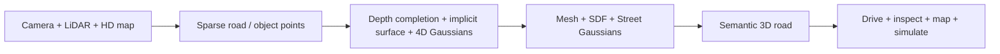

# From Sparse Road Points to Living 3D Roads

**Deep Learning Is Reinventing Transportation & Mobility**

Curated GitHub repositories for the eight deep-learning directions and nine applications on the *From Sparse Road Points to Living 3D Roads* poster. Sister catalog: [living-3d-twins](https://github.com/ahmaddroobi99/living-3d-twins) (infrastructure poster). This repo is the mobility poster.

[](https://github.com/ahmaddroobi99/living-3d-roads)
[](docs/01-deep-learning-directions.md)
[](docs/02-applications.md)

## Pipeline



## The 8 deep-learning directions

Exact titles from the poster.

| # | Method | Caption on the card |
|---|---|---|
| 1 | NeRF-Drive | Differentiable triangulation |
| 2 | UrbanImplicit | Neural implicit surfaces |
| 3 | DepthFormer | Learned depth interpolation |
| 4 | GaussianDrive | Gaussian + mesh |
| 5 | GeoGuideNet | Depth / normal-guided surface |
| 6 | DynSurf | Dynamic neural surface |
| 7 | 4D-DriveGS | 4D Gaussian reconstruction |
| 8 | SceneSem3D | Semantic 3D reconstruction |

Full eight-repo lists: [docs/01-deep-learning-directions.md](docs/01-deep-learning-directions.md)

Hubs: [EmerNeRF](https://github.com/NVlabs/EmerNeRF) · [S-NeRF](https://github.com/fudan-zvg/S-NeRF) · [StreetSurf](https://github.com/PJLab-ADG/neuralsim) · [Street Gaussians](https://github.com/zju3dv/street_gaussians) · [DrivingGaussian](https://github.com/VDIGPKU/DrivingGaussian) · [S3Gaussian](https://github.com/nnanhuang/S3Gaussian) · [3DGS](https://github.com/graphdeco-inria/gaussian-splatting)

## The 9 applications

| # | Application | What the living road is for |
|---|---|---|
| 1 | Autonomous Driving | Continuous 3D environment for safe navigation |
| 2 | Road Surface Reconstruction | Accurate and continuous road geometry |
| 3 | Pothole & Road-Damage Mapping | Detect and measure surface deformation |
| 4 | Pedestrian & Cyclist Modeling | 3D representation of moving road users |
| 5 | Vehicle Shape Reconstruction | Complete vehicle geometry from partial views |
| 6 | Intersection Digital Twins | Realistic, structured 3D junction models |
| 7 | HD Map Generation | Lanes, traffic signs and infrastructure mapping |
| 8 | Collision & Free-Space Estimation | Dense geometry for obstacle and free-space reasoning |
| 9 | Autonomous-Vehicle Simulation | Real-world 3D environments for testing and training |

Full eight-repo lists: [docs/02-applications.md](docs/02-applications.md)

## Working slice

`living_roads.reconstruct()` runs the poster pipeline at toy scale: sparse XYH → RBF surface → Gaussian proxies → pothole residual + free-space. Not a trained NeRF.

```bash
python -m pip install -e .
pytest -q
python examples/01_sparse_to_surface.py
python -m living_roads.cli reconstruct
```

On the default seed the surface RMSE is ~1.2 cm and the planted pothole is recovered.

## Selection policy

Official paper code first. Poster card names stay verbatim. Links checked 2026-09-07. This catalog is a research map, not a fork of the linked projects.

## License

MIT. Linked projects keep their own licenses.
